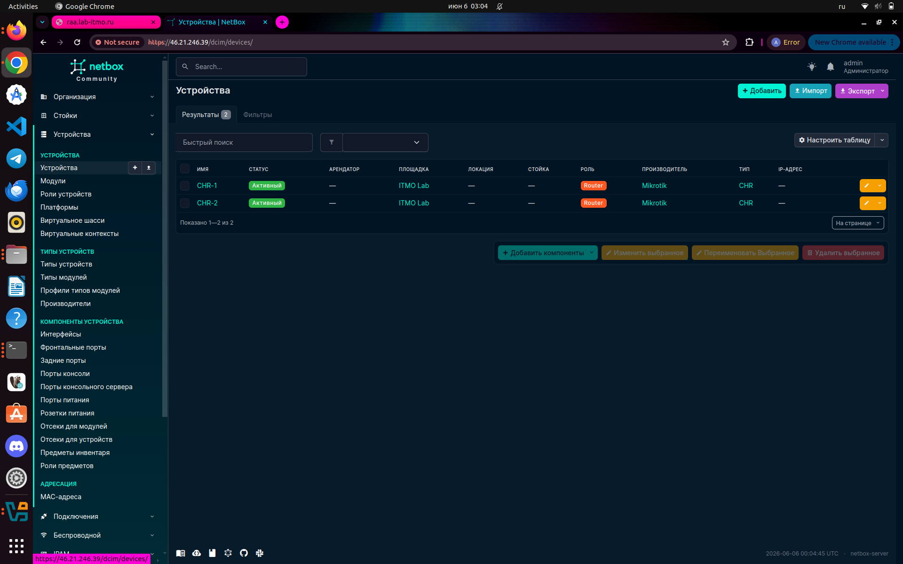
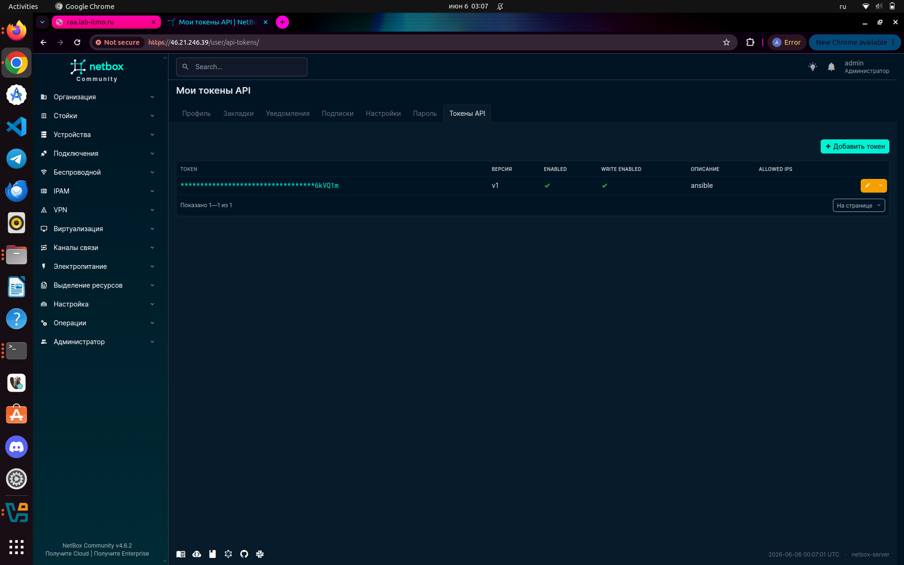
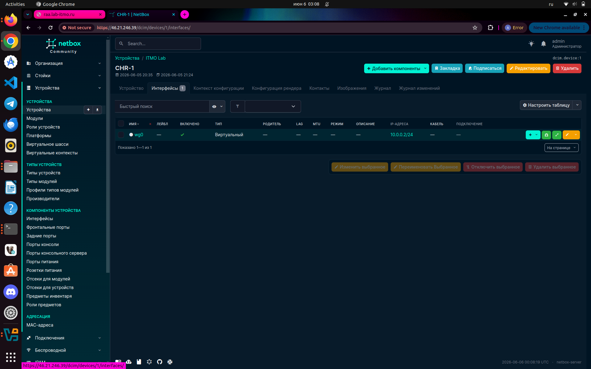
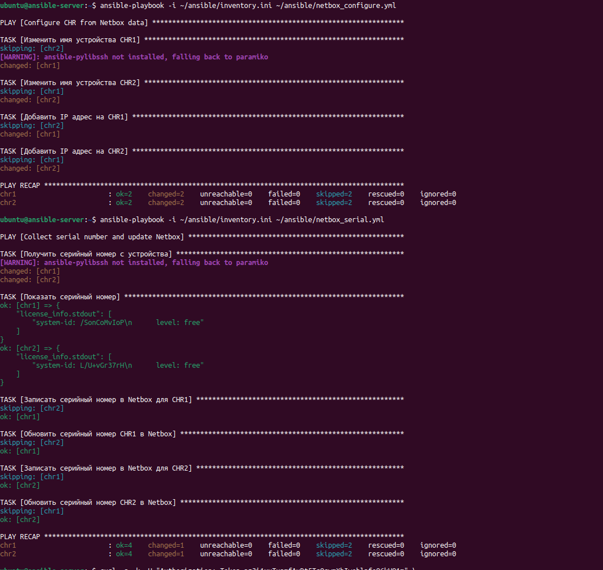
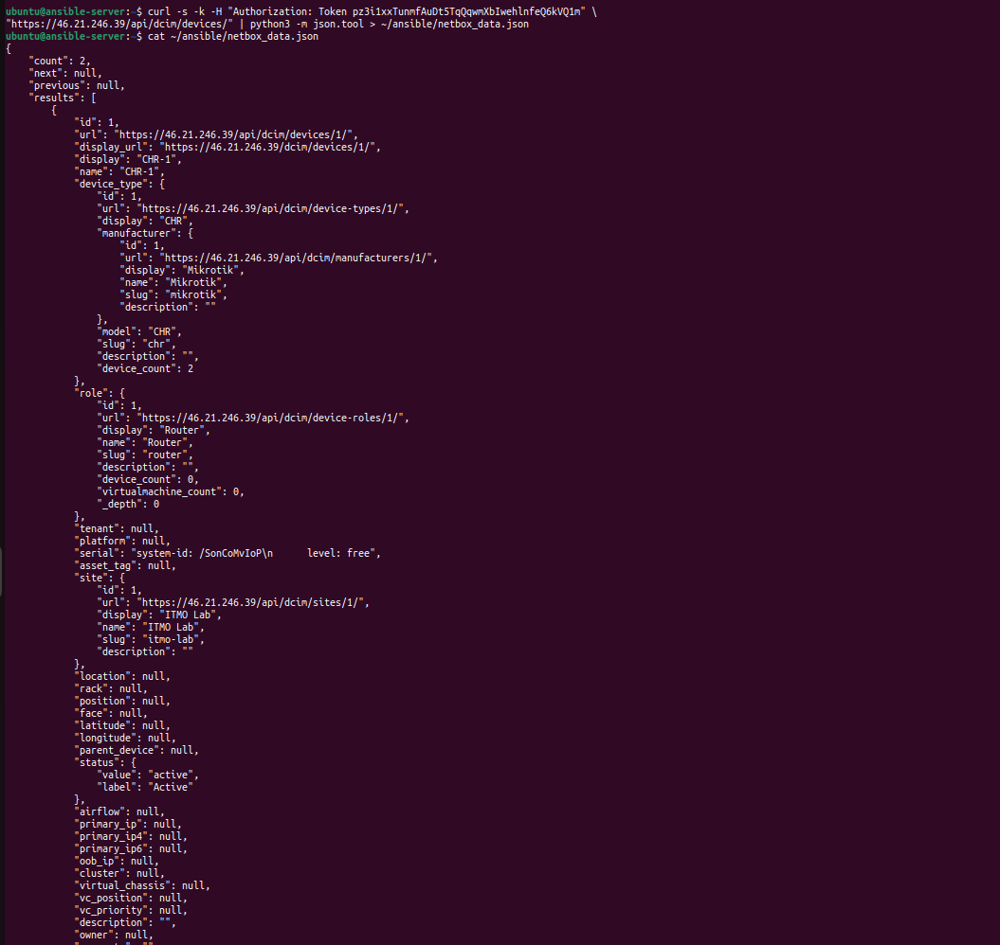

University: [ITMO University](https://itmo.ru/ru/)

Faculty: [FICT](https://fict.itmo.ru)

Course: [Network programming](https://github.com/itmo-ict-faculty/network-programming)

Year: 2025/2026

Group: K3320

Author: Rodionov Anatoliy Alexandrovich

Lab: Lab3

Date of create: 17.05.2026

Date of finished: 17.05.2026

# Лабораторная работа №3

## Задание

<https://itmo-ict-faculty.github.io/network-programming/education/labs2023_2024/lab3/lab3/>

### Netbox

Поднял netbox с помощью docker-compose и создал admin-пользователя:

```bash
git clone -b release https://github.com/netbox-community/netbox-docker.git
cd netbox-docker

cp docker-compose.override.yml.example docker-compose.override.yml

docker compose up -d --pull always

docker compose exec netbox /opt/netbox/netbox/manage.py createsuperuser
```

Добавил роутеры и создал API-токен:





К каждому роутеру добавил интерфейсы:




### Ansible

#### [configure_router_from_netbox](./playbooks/configure_router_from_netbox.yml)

Этот playbook берет данные об устройствах из netbox и применяет их к chr через. Сначала он находит устройство в netbox по имени из inventory, затем получает назначенные IP-адреса и формирует желаемую конфигурацию. В безопасном режиме playbook только показывает, какие изменения будут выполнены, а для реального применения используется переменная `apply_changes=true`.

#### [export_netbox_data](./playbooks/export_netbox_data.yml)

Данный playbook обращается к API netbox. Он забирает основные объекты, которые нужны для дальнейшей работы: устройства, интерфейсы, IP-адреса, префиксы, роли, платформы и теги. Дополнительно используется lookup из коллекции netbox.netbox.

#### [sync_serial_to_netbox](./playbooks/sync_serial_to_netbox.yml)

Этот playbook подключается к chr, получает идентификатор устройства и при необходимости записывает его обратно в netbox. Для che серийный номер берется из вывода команды /system license print. По умолчанию playbook работает в режиме проверки, а обновление netbox выполняется при запуске с переменной `update_netbox=true`.

#### Применение playbook'ов

Сначала прокатил `configure_router_from_netbox`:

```bash
panindv@lab-1:~/lab3$ ansible-playbook -i inventories/netbox/netbox_inventory.yml playbooks/sync_serial_to_netbox.yml -e update_netbox=true

PLAY [Collect CHR serial number and update NetBox] *************************************************************************************************************************************************************
[WARNING]: Found variable using reserved name: tags
[WARNING]: Found variable using reserved name: serial

TASK [Get NetBox device by inventory hostname] *****************************************************************************************************************************************************************
ok: [chr2 -> localhost]
ok: [chr1 -> localhost]

TASK [Check that device exists in NetBox] **********************************************************************************************************************************************************************
ok: [chr1] => {
    "changed": false,
    "msg": "All assertions passed"
}
ok: [chr2] => {
    "changed": false,
    "msg": "All assertions passed"
}

TASK [Save NetBox device id] ***********************************************************************************************************************************************************************************
ok: [chr1]
ok: [chr2]

TASK [Collect RouterOS facts] **********************************************************************************************************************************************************************************
ok: [chr2]
ok: [chr1]

TASK [Read RouterOS license] ***********************************************************************************************************************************************************************************
ok: [chr1]
ok: [chr2]

TASK [Extract system-id from license info] *********************************************************************************************************************************************************************
ok: [chr1]
ok: [chr2]

TASK [Choose final serial value] *******************************************************************************************************************************************************************************
ok: [chr1]
ok: [chr2]

TASK [Show detected serial number] *****************************************************************************************************************************************************************************
ok: [chr1] => {
    "msg": {
        "ansible_net_serialnum": "",
        "device": "chr1",
        "serial": "dC6ZHKOx92F",
        "serial_from_license": "dC6ZHKOx92F",
        "update_netbox": "true"
    }
}
ok: [chr2] => {
    "msg": {
        "ansible_net_serialnum": "",
        "device": "chr2",
        "serial": "CL50ymvO7UJ",
        "serial_from_license": "CL50ymvO7UJ",
        "update_netbox": "true"
    }
}

TASK [Ensure output directory exists] **************************************************************************************************************************************************************************
ok: [chr2 -> localhost]
ok: [chr1 -> localhost]

TASK [Update serial number in NetBox] **************************************************************************************************************************************************************************
ok: [chr2 -> localhost]
ok: [chr1 -> localhost]

TASK [Save collected RouterOS facts locally] *******************************************************************************************************************************************************************
changed: [chr2 -> localhost]
changed: [chr1 -> localhost]

TASK [Save raw serial command output locally] ******************************************************************************************************************************************************************
ok: [chr1 -> localhost]
ok: [chr2 -> localhost]

PLAY RECAP *****************************************************************************************************************************************************************************************************
chr1                       : ok=12   changed=1    unreachable=0    failed=0    skipped=0    rescued=0    ignored=0
chr2                       : ok=12   changed=1    unreachable=0    failed=0    skipped=0    rescued=0    ignored=0
```

Плейбуки:






': None, 'connected_endpoints': None, 'connected_endpoints_type': None, 'connected_endpoints_reachable': False, 'owner': None, 'tags': [], 'custom_fields': {}, 'created': '2026-05-17T16:06:03.174040Z', 'last_updated': '2026-05-17T16:06:03.174055Z', 'count_ipaddresses': 1, 'count_fhrp_groups': 0, '_occupied': False}, {'id': 6, 'url': 'http://62.233.43.144:8000/api/dcim/interfaces/6/',  {'id':

TASK [Add nb_lookup result to dump] ****************************************************************************************************************************************************************************
ok: [localhost]

TASK [Save NetBox dump to file] ********************************************************************************************************************************************************************************
changed: [localhost]

PLAY RECAP *****************************************************************************************************************************************************************************************************
localhost                  : ok=6    changed=1    unreachable=0    failed=0    skipped=0    rescued=0    ignored=0
```

Информация лежит в [out](./out)

## Заключение

В ходе работы был развернут netbox и написано три сценария ansible, которые могут забрать информацию об устройстве из netbox, поправить устройство и сделать записи в netbox.
