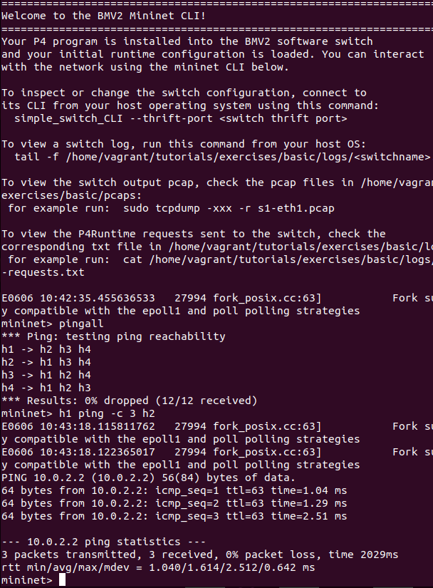

University: [ITMO University](https://itmo.ru/ru/)

Faculty: [FICT](https://fict.itmo.ru)

Course: [Network programming](https://github.com/itmo-ict-faculty/network-programming)

Year: 2025/2026

Group: K3320

Author: Rodionov Anatoliy Alexandrovich

Lab: Lab4

Date of create: 23.05.2026

Date of finished: 23.05.2026

# Лабораторная работа №4

## Задание

<https://itmo-ict-faculty.github.io/network-programming/education/labs2023_2024/lab4/lab4/>

### Подготовка среды

Был склонирован репозиторий с упражнениями:

```bash
git clone https://github.com/p4lang/tutorials.git
cd tutorials/vm-ubuntu-24.04
vagrant up
```

Далее на самой виртуалке подготовил систему:

```bash
cd
git clone https://github.com/p4lang/tutorials
./tutorials/vm-ubuntu-24.04/install.sh |& tee log.txt
source ~/p4setup.bash
```

### Basic Forwarding

Перешел в папку первого упражнения:

```bash
cd ~/tutorials/exercises/basic
```

В файл `basic.p4` была добавлена логика разбора Ethernet/IPv4, таблица `ipv4_lpm`, действие `ipv4_forward` и deparser. Исправленный файл также сохранен в репозитории лабораторной: [basic.p4](./basic.p4).

Ключевая логика forwarding:

```p4
action ipv4_forward(macAddr_t dstAddr, egressSpec_t port) {
    standard_metadata.egress_spec = port;
    hdr.ethernet.srcAddr = hdr.ethernet.dstAddr;
    hdr.ethernet.dstAddr = dstAddr;
    hdr.ipv4.ttl = hdr.ipv4.ttl - 1;
}

table ipv4_lpm {
    key = {
        hdr.ipv4.dstAddr: lpm;
    }
    actions = {
        ipv4_forward;
        drop;
        NoAction;
    }
    size = 1024;
    default_action = drop();
}
```

Запуск:

```bash
make run
```

Проверка связности в Mininet:


[basic_tunnel.p4](./Screenshot from 2026-06-10 04-42-51.p4).
[basic_tunnel.p4](./Screenshot from 2026-06-10 04-43-40.p4).

После проверки Mininet был остановлен:

```bash
make stop
make clean
```

### Basic Tunneling

Перешел в папку второго упражнения:

```bash
cd ~/tutorials/exercises/basic_tunnel
```

В `basic_tunnel.p4` была добавлена поддержка собственного заголовка `myTunnel`, разбор `etherType = 0x1212`, таблица точного совпадения `myTunnel_exact` и deparser, который выпускает заголовки в порядке `ethernet`, `myTunnel`, `ipv4`. Исправленный файл сохранен в репозитории лабораторной:
реультаты
[basic_tunnel.p4](./Screenshot from 2026-06-10 04-44-33.p4).
[basic_tunnel.p4](./Screenshot from 2026-06-10 04-46-05.p4).

Ключевая часть ingress pipeline:

```p4
action myTunnel_forward(egressSpec_t port) {
    standard_metadata.egress_spec = port;
}

table myTunnel_exact {
    key = {
        hdr.myTunnel.dst_id: exact;
    }
    actions = {
        myTunnel_forward;
        drop;
    }
    size = 1024;
    default_action = drop();
}

apply {
    if (hdr.myTunnel.isValid()) {
        myTunnel_exact.apply();
    } else if (hdr.ipv4.isValid()) {
        ipv4_lpm.apply();
    }
}
```

Статические правила управления из `s1-runtime.json`, `s2-runtime.json`, `s3-runtime.json` используют таблицу `MyIngress.myTunnel_exact` и сопоставляют `dst_id` с выходным портом. Например:

```json
{
  "table": "MyIngress.myTunnel_exact",
  "match": {
    "hdr.myTunnel.dst_id": [2]
  },
  "action_name": "MyIngress.myTunnel_forward",
  "action_params": {
    "port": 2
  }
}
```

Запуск:

```bash
make run
```

P4-программа успешно скомпилировалась:

```bash
p4c-bm2-ss --p4v 16 --p4runtime-file build/basic_tunnel.p4info --p4runtime-format text -o build/basic_tunnel.json basic_tunnel.p4
```

Проверка обычной IP-маршрутизации без туннеля:

```bash
mininet> xterm h1 h2
```

В терминале `h2`:

```bash
./receive.py
```

В терминале `h1`:

```bash
./send.py 10.0.2.2 plain-ip
```

 назначения:

```bash
./send.py 10.0.3.3 tunnel-ip-h3-dstid2 --dst_id 2
```

Результат на `h2`:


Пакет пришел на `h2`, хотя IP-адрес `10.0.3.3` принадлежит `h3`. Это подтверждает, что для инкапсулированных пакетов коммутатор использует поле `dst_id` из заголовка `myTunnel`.

После проверки Mininet был остановлен:

```bash
make stop
make clean
```

## Заключение

В ходе лабораторной работы была подготовлена среда для запуска P4-упражнений. В первом упражнении реализована базовая IPv4-коммутация: парсинг Ethernet/IPv4, LPM-таблица, изменение MAC-адресов, уменьшение TTL и выпуск пакета через нужный порт. Во втором упражнении реализовано туннелирование с собственным заголовком `myTunnel` и отдельной таблицей forwarding по `dst_id`. Проверки `pingall` и отправки сообщений через `send.py`/`receive.py` подтвердили локальную связность и корректную обработку туннелированных пакетов. Цель работы достигнута.
